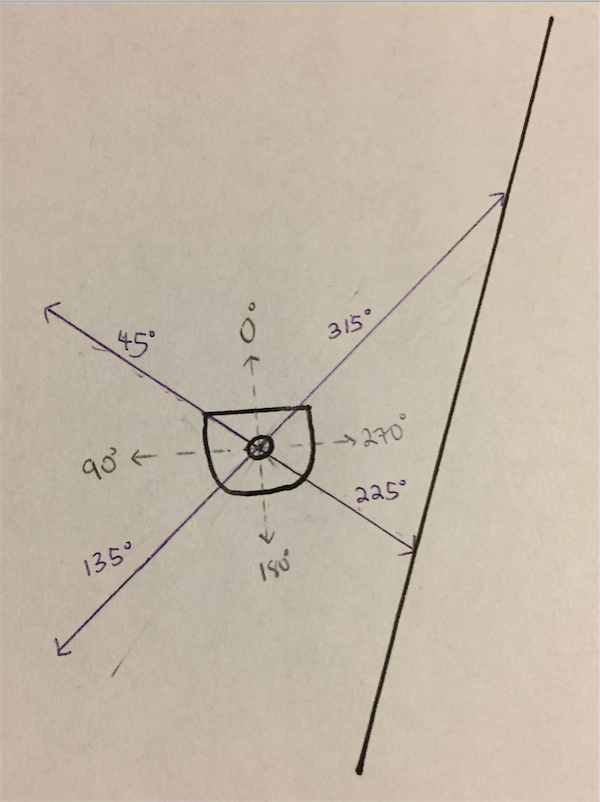
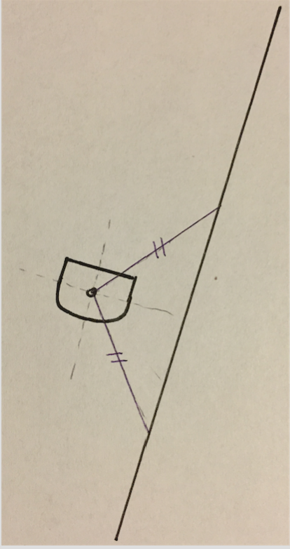
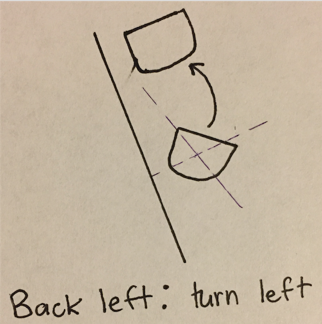
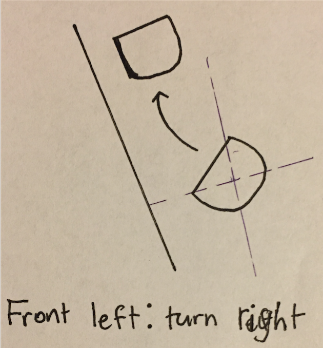

# CompRobo Warmup Project
##### Kim Asenbeck, Brenna Manning, Jordan Van Duyne

For this project, we have programmed a Neato robot to perform a few different tasks.
These included “Teleop Twist”, driving the neato in a square, and following a wall.


### Writeup
- For each behavior, describe the problem at a high-level.  Include any relevant diagrams that help explain your approach.  Discuss your strategy at a high-level and include any tricky decisions that had to be made to realize a successful implementation.

- For the finite state controller, what was the overall behavior.  What were the states? What did the robot do in each state? How did you combine and how did you detect when to transition between behaviors?  Consider including a state transition diagram in your writeup.

- How was your code structured?  Make sure to include a sufficient detail about the object-oriented structure you used for your project.

- What if any challenges did you face along the way?

- What would you do to improve your project if you had more time?

- What are the key takeaways from this assignment for future robotic programming projects?


# Teleop Twist
In this task, we wrote our own code to teleoperate the robot. Our code is meant to mimic the behavior of teleop_twist_keyboard. To determine the appropriate twist for each keystroke, we ran “rostopic pub /cmd_vel Twist” from the command line, while running teleop_twist_keyboard. Doing this allowed us to observe the linear and angular values tied to each keystroke within teleop_twist_keyboard.
We structured our code within a TeleopNode class. After detecting a keystroke, we enter the corresponding conditional statement. Within each condition, we set the appropriate values for the twist. The twist is then published, and the neato moves as directed.

# Drive Square
For this task, we wrote code to make the robot drive in a 1m by 1m square path using timing. Similarly to the Teleop Twist task, we published a twist using  /cmd_vel Twist to make the robot move.  This code was structured within a SquareNode class, and switched between two states: “forward” and “turning”. In the forward state, the robot is sent a twist with a positive linear vector of (1.0, 0,0, 0.0) so that it moves forward.  Using this twist, the robot will drive forward at 1 m/s, so after 1 second has passed it will have driven 1 meter. After 1 second has passed in the driving forward state, the state switches to the turning state. Here, the robot is sent a twist with an angular vector of (0.0, 0.0, 0.5) which causes it to rotate left at a speed of 0.5 radians per second. After approximately pi seconds, a full 90 degree turn is completed, and the state is switched back to the forward state. This repeats until the robot has fully driven in a square.


# Wall following

The goal of the wall following behavior is to enable a Neato situated near a wall to drive forward and parallel along that nearest wall.

## Detecting nearest wall
In order to drive parallel to the nearest wall, the nearest wall first has to be identified: where is this wall relative to the Neato?



We use the Lidar laser sensor to determine the range distance between each of the Neato's four corners (corresponding to 45˚, 135˚, 225˚, and 315˚ of the laser) and any obstacle in those directions. As shown in the picture above, we will assume that the corner associated with the smallest range is the corner that is closest to a wall.

## Aligning with the wall
In order for the Neato to be considered parallel with the wall, both range distance readings from the side (left or right) of the closest corner have to be within a certain threshold of each other. For example, if the back right corner is considered to be the closest corner and has a range reading of 0.9 m, the front right corner should also have a range reading of 0.9 m. This state is shown in the picture below.



However, due to difficulty with timing and not infinitely accurate sensors, the two readings from the same side will almost never be exactly the same. Thus, we consider them to be close enough for the Neato to be parallel if their difference is less than .25 m. This threshold was determined through trial and error. Smaller thresholds caused the Neato to spend too much time aligning itself with the wall due to not being considered parallel, while larger thresholds caused alignments that were obviously skewed to be considered parallel.

If the difference of the two readings is within the threshold, then great! The Neato is parallel to the wall and can move forward. However, if the readings are too far apart, the Neato needs to turn to align itself with the wall. The direction in which it needs to turn depends on which corner is closest to the wall and is shown in the diagrams below. The Neato has achieved parallel alignment once it has turned enough that the difference between the two readings is within the threshold.





## Implementation
In order to achieve this functionality, we subscribe to the `/scan LaserScan` message in order to find the laser's readings. We have a callback `WallFollower.process_scan(self, m)` that saves the ranges associated with the four corners every time a `/scan` message is published.

At the same time, we are constantly running a `while` loop that does all of the computation necessary to determine how the Neato should act. As long as range readings are available (meaning `WallFollower.process_scan(self, m)` has been called at least once), the closest corner is identified by comparing the saved scan readings. Then, the parallel test is performed (checking if the readings from the closest corner and the other corner on the same side are close enough) and the state of parallel-ness is set to either `True` or `False`. If the Neato is parallel, then a `/cmd_vel Twist` message object is created with a forward (linear x) velocity of 1.0 m/s. If The Neato is not parallel, then a `/cmd_vel Twist` message object is created with an angular (z) velocity of ±0.4 radians/s to turn the Neato in the appropriate direction to help it achieve parallel-ness. Then, after the correct Twist object is created, the `/cmd_vel Twist` message is published. Then the loop starts over from the beginning!

## Decisions and challenges
The first decision we had to make was having the Neato repeatedly check if it is parallel to the wall. If we had simply allowed it to move forward indefinitely as soon as it was first calculated to be parallel, it could easily stray from the wall if it was even slightly skewed before it started going forward.

Determining the correct turn velocity and the correct parallel threshold values was also difficult. Too fast of a velocity results in the Neato overshooting the parallel state between range updates, causing the Neato be stuck in a "twitching back and forth" motion. Too slow a speed and the Neato is just too slow to behave nicely. A small range threshold, similar to too fast of an angular velocity, results in a twitch motion because falling within the range is too difficult. Too large a range and what the program considers parallel is actually very skewed.

// a large challenge we faced was dealing with updating the neato's speed based on the newest laser readings; it is possible the readings might not have come in yet.


# Finite state controller

Our finite state controller combined our drive square and person follower programs. The Neato starts off by driving in a square, repeatedly. As soon as a person is detected within the person following range, the Neato transitions to following that person. If the Neato loses sight of the person, it transitions back to driving in a square, as shown below.

## Drive square

As explained above in the [Drive square section](#drive-square), the drive square state, within itself, is made up of two states: going forward and turning left. Transitions between these states are time based: the forward velocity in the forward state is set such that 1 meter will have been traveled after 2 seconds, while the angular velocity of the turning state is set so that the Neato will have turned 90˚ after 3 seconds.

## Person following

As explained above in the [Person following section](#person-following), the person following state has the Neato drive, with forward and angular velocity proportional to the distance to the person, up to the person. A person is identified as the center of mass of the distance readings in front of the Neato from the lidar laser scan.

## Connecting the two

In our Python implementations of both drive_square.py and person_follow.py we used object-oriented programming, with all functionality necessary for the execution of a node split into methods belonging to that respective node's object. Thus, in order to gain access to all of this logic we had already implemented, we simply had to import both our ```SquareNode``` and ```PersonNode``` classes and instantiate them as class attributes in our ```FSM``` class of finite_state_controller.py.

Thankfully, since we originally implemented drive square as an FSM, every method of ```DriveSquare``` that represents a state returns the method that should be the next state: if the appropriate amount of time has passed (between the time of the beginning of this state and the current time) to signal the completion of the current state, reset the time for the beginning of the state and return the next state; else, return the same current state. This functionality allowed our main ```DriveSquare.run()``` method to simply initialize the current state as the forward state, and then, while the program has not been terminated, actually call the method of the current state (causing the Neato to do the desired behavior) and, afterwards, reassign the current state to be the return value of the method that was just called. There were only two such state methods: ```DriveSquare.go_forward()``` and ```DriveSquare.turn_left()```. This allowed for clean state transitions.

However, ```PersonNode``` was not implemented as an FSM, as there is only one action of person follower: if there is a person, follow it. This action is completed by the ```PersonNode.calculate_velocity()``` method, which determines what the Neato's velocity should be in order to successfully follow the person. In person_follow.py, this method was called over and over again in a while loop of the main ```PersonNode.run()``` method. So, in order to make it a state, it just had to return itself! Adding this simple edit to person_follow.py did not affect our original person follower program.

Now that we had access to all of the needed states, we had to be able to transition between driving in a square and following a person. In the main ```FSM.run()``` method, we create a current state ```curr_state``` variable and instantiate it to ```self.drive_square.go_forward```, making the start state of the FSM the go forward state of the encompassing square state. Then, within a while loop, we check if a person has been identified, and, if so, reset ```curr_state``` to be ```self.person_follower.calculate_velocity```. Else, if ```curr_state``` is equal to ```self.person_follower.calculate_velocity```, then the Neato had been in the person follower state but just lost sight of the person. As a result, we set ```curr_state``` back to ```self.drive_square.go_forward```, the beginning of the overall square state. If neither of these two conditions are true, that means that the Neato was previously driving in a square and should continue to do so, so we do not reset ```curr_state```, as the square state should transition between its two internal states on its own. We then actually call ```curr_state()``` to allow the Neato to execute the method save to ```curr_state```. ```curr_state``` is then set to the return value of this method call, so that everything goes smoothly in the next run of the while loop.

We check if there is a person before executing ```curr_state()``` in order to allow the Neato to start following a person immediately. If we called ```curr_state()``` before checking if there was a person, the Neato would continue its previous action before actually going towards the person.

### Process scan callback

Being able to execute the current state and set the next state is great, but is pointless if there is no implementation for triggering the transitions between the drive square and person following states. Thus, we subscribe to the ```LaserScan /scan``` topic and have a callback ```FSM.process_scan(m)```. Within this callback, we call ```self.person_follower.process_scan(m)``` and ```self.person_follower.find_person()```. Calling these two methods allows the ```PersonNode``` logic of identifying a person based off of laser readings to be executed every time there is new laser data. This allows person identifying to be independent of the actual execution of the states in ```FSM.run()```.

### Publishing Twists

All three of the states are executed by the Neato by publishing a Twist velocity over the ```/cmd_vel``` topic. In order to keep this publishing within ```FSM``` and not in the ```SquareNode``` or ```PersonNode``` classes, every state method sets a ```self.twist``` attribute to the appropriate Twist, where ```self``` is the appropriate class of that method. Then, in the while loop of ```FSM.run()```, in the same places where we set ```curr_state``` to the appropriate person following or drive square methods, we also set ```self.twist``` of our ```FSM``` object to be the ```twist``` attribute of the appropriate class. For example, if there is a person, we set ```self.twist = self.person_follower.twist```.

Then, after ```curr_state()``` has been executed, we publish this ```twist``` attribute of ```FSM```.
